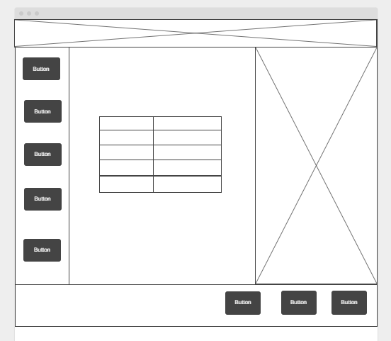
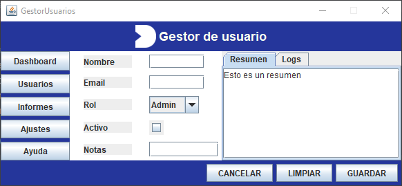
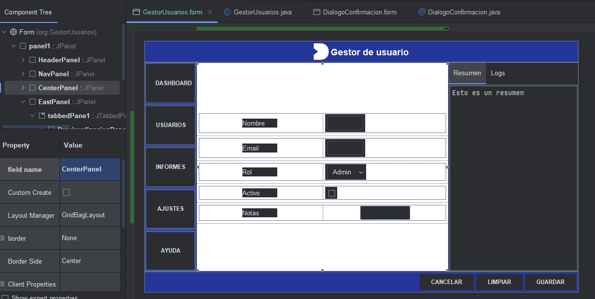
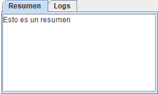
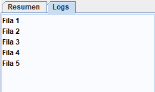
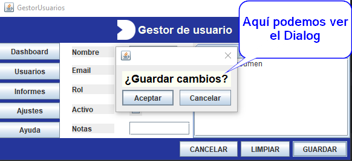

# Gestor de Usuarios

## 1️⃣ Wireframe y Árbol de Contenedores

**Wireframe:**



**Árbol de Contenedores:**
```
JFrame (BorderLayout)
 ├─ NORTH: headerPanel (FlowLayout) – título + icono
 ├─ WEST: navPanel (GridLayout 5x1) – botones de navegación
 ├─ CENTER: formPanel (GridBagLayout) – etiquetas y campos
 ├─ EAST: previewPanel (BorderLayout) → JTabbedPane (Resumen + Logs)
 └─ SOUTH: buttonBar (FlowLayout RIGHT) – botones Cancelar, Limpiar, Guardar
```

**Justificación de layouts:**
- **BorderLayout:** divide la ventana en zonas principales.
- **FlowLayout:** header y botonera para filas alineadas.
- **GridLayout:** navegación para botones uniformes verticales.
- **GridBagLayout:** formulario, control preciso de filas, columnas y expansión.

---

## 2️⃣ Capturas de pantalla
1. Vista general de la ventana completa




2. Redimensionada (CENTER y Notas crecen).



3. Pestañas del JTabbedPane (“Resumen” y “Logs”).

   

4. Diálogo modal abierto (“¿Guardar cambios?”).



---

## 3️⃣ Tabla de propiedades clave

| Componente | Layout/Panel | Propiedades importantes |
|------------|--------------|-----------------------|
| JLabel título | headerPanel / FlowLayout | font Bold 18, icon, insets opcional |
| Botones nav | navPanel / GridLayout | Same Size Horizontally, vgap=5 |
| Campos formulario | formPanel / GridBagLayout | weightx=1 (campos), weighty=1 (Notas), fill HORIZONTAL/BOTH, anchor WEST, insets 5 |
| JTabbedPane | previewPanel / BorderLayout | PreferredSize ancho ~260px |
| Botonera | buttonBar / FlowLayout RIGHT | Same Size Horizontally, Default Button = Guardar |

---

## 4️⃣ Confirmación / Diálogo modal
- **Tipo:** JDialog modal
- **Componentes:** JLabel + 2 botones (Aceptar, Cancelar)
- **Código de apertura mínimo:**
```java
DialogConfirmacion dialog = new DialogConfirmacion();
dialog.setModal(true);
dialog.pack();
dialog.setVisible(true);
```

---

## 5️⃣ Observaciones y Ajustes
- CENTER y Notas crecen correctamente con weightx/weighty + fill.
- EAST mantiene ancho constante.
- Botonera alineada a la derecha con FlowLayout RIGHT.
- Insets, gaps y alignment revisados en todos los paneles.

---

## 6️⃣ Repositorio GitHub
- Están publicados los archivos .java, .form y el Readme.md.
- Se incluyen imagenes con las pruebas de la interfaz.

---

## 7️⃣ Opcionales / Retos
- Añadir JMenuBar arriba (Archivo/Editar/Ayuda).
- Botonera con GridLayout(1,3) y compararla con FlowLayout RIGHT.
- Formulario solo GridBag con gridwidth=2 para Notas (practicar spans).

